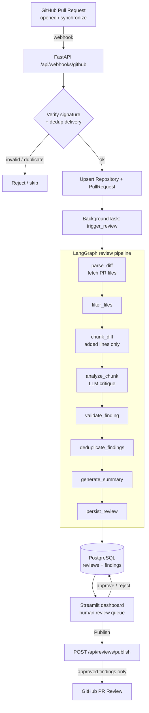

<div align="center">

# 🤖 CodeReviewBot

### An AI code reviewer that reads your pull requests, flags real problems, and waits for a human to sign off before it ever posts.

[](https://www.python.org/)
[](https://fastapi.tiangolo.com/)
[](https://langchain-ai.github.io/langgraph/)
[](https://streamlit.io/)
[](https://www.postgresql.org/)
[](#-license)

</div>

---

## The Problem It Solves

Code review is where good engineering happens — and where it quietly rots. Reviewers are busy, so pull requests sit for hours. When they do get looked at, attention is uneven: the first files get a [...]

Fully automated reviewers don't fix this — they make it worse. An LLM let loose on a diff hallucinates line numbers, invents issues to look useful, and posts a wall of low-signal comments directly t[...]

**CodeReviewBot splits the difference.** The machine does the tedious part — reading every added line of every file, every time — but it is never allowed to speak to the author on its own. Every f[...]

## The Solution

A PR opens on GitHub. A webhook fires. CodeReviewBot fetches the real diff, walks it through a deterministic pipeline that chunks the changes and asks an LLM to critique only the lines that actually c[...]

The LLM is swappable — point it at a local [Ollama](https://ollama.com/) model for zero-cost private reviews, or at any OpenAI-compatible endpoint. Nothing about the pipeline assumes a specific vend[...]

## Core Features

| Feature | What it does |
| --- | --- |
| 🔐 **Verified webhooks** | Every delivery is checked against the GitHub `X-Hub-Signature-256` HMAC in constant time, and de-duplicated by delivery ID so a retried webhook never reviews the same pu[...] |
| 🧩 **Real-diff analysis** | Fetches the actual PR diff (paginated), parses unified-diff hunks back to real line numbers, and sends the LLM *only the added lines* — so every comment cites a line [...] |
| 🧠 **Vendor-agnostic LLM** | Runs against local Ollama or any OpenAI-compatible API. Malformed model output degrades to "no findings" instead of crashing the run. |
| 🪶 **Noise control** | Findings with thin explanations or low confidence are dropped, and near-duplicate comments on the same region are collapsed before a human ever sees them. |
| 👤 **Human-in-the-loop** | Nothing is posted automatically. A Streamlit queue lets a reviewer approve / reject / edit each finding; only approved ones publish. |
| 📊 **ML risk scoring** | An optional XGBoost model scores each finding's likelihood of being actionable (with SHAP explainability), degrading gracefully to a neutral 0.5 when no model is trained. [...] |
| 🐳 **One-command stack** | API, Postgres, and dashboard come up together via Docker Compose with a healthchecked database. |

## Architecture



## Tech Stack

- **API** — [FastAPI](https://fastapi.tiangolo.com/) + Uvicorn, with `BackgroundTasks` for fire-and-return webhook handling
- **Pipeline** — [LangGraph](https://langchain-ai.github.io/langgraph/) `StateGraph` (8 ordered, side-effect-isolated nodes)
- **Persistence** — [SQLAlchemy 2.0](https://www.sqlalchemy.org/) ORM over PostgreSQL 16, migrations via [Alembic](https://alembic.sqlalchemy.org/)
- **LLM** — Ollama or any OpenAI-compatible endpoint (`httpx`)
- **ML** — XGBoost + SHAP, served through scikit-learn / joblib
- **UI** — [Streamlit](https://streamlit.io/) review dashboard
- **Tooling** — [uv](https://docs.astral.sh/uv/) for env + deps, Ruff, mypy, pytest

## Quickstart

The fastest path is Docker Compose — it brings up the API, a healthchecked Postgres, and the dashboard together.

### 1. Clone and configure

```bash
git clone https://github.com/Taruntripathii/code-review.git
cd code-review
cp .env.example .env
```

Edit `.env` and set at minimum:

- `GITHUB_TOKEN` — a personal access token with `repo` scope (reads PR files, posts reviews)
- `GITHUB_WEBHOOK_SECRET` — the shared secret you'll configure on the GitHub webhook
- `LLM_BASE_URL` / `LLM_MODEL` — e.g. `http://localhost:11434` + `llama3` for Ollama, or an OpenAI-compatible URL + `LLM_API_KEY`

### 2. Bring up the stack

```bash
docker compose up -d --build
```

| Service | URL |
| --- | --- |
| API (FastAPI) | http://localhost:8000 |
| Review dashboard (Streamlit) | http://localhost:8501 |
| Postgres | localhost:**5433** (published) |

> **Port note:** Compose publishes Postgres on host port **5433** to avoid clashing with a local Postgres on 5432. If you run the API *outside* Docker, point `DATABASE_URL` at `localhost:5433`.

### 3. Point GitHub at it

Expose your local API (e.g. with [ngrok](https://ngrok.com/): `ngrok http 8000`) and add a repository webhook:

- **Payload URL:** `https://<your-tunnel>/api/webhooks/github`
- **Content type:** `application/json`
- **Secret:** the same value as `GITHUB_WEBHOOK_SECRET`
- **Events:** *Pull requests*

Open or push to a PR and the review appears in the dashboard.

### Local development (without Docker)

```bash
uv sync                       # install dependencies
uv run alembic upgrade head   # apply DB migrations
uv run uvicorn backend.app.main:app --reload   # API on :8000
uv run streamlit run dashboard/app.py          # dashboard on :8501
```

## API Reference

| Method | Endpoint | Description |
| --- | --- | --- |
| `GET` | `/health` | Liveness probe. |
| `POST` | `/api/webhooks/github` | GitHub webhook receiver — verifies signature, dedups, schedules a review. |
| `GET` | `/api/reviews?status=PENDING_HUMAN_REVIEW` | List reviews, optionally filtered by status. |
| `GET` | `/api/reviews/{review_id}/findings` | Findings for a review, each with its latest human decision. |
| `PATCH` | `/api/findings/{finding_id}` | Record a decision: `{"decision": "approved" \| "rejected" \| "edited"}`. |
| `POST` | `/api/reviews/{review_id}/publish` | Post approved findings to the PR as a single GitHub review. |

## Optional: train the ML risk model

The pipeline runs fine without it (findings score a neutral 0.5). To enable risk scoring, provide `ml/data/training_set.csv` and train:

```bash
uv run python ml/train.py
```

This writes `ml/artifacts/xgboost_model.pkl` and a feature schema; the predictor loads it automatically.

## Testing

```bash
uv run ruff check . && uv run ruff format --check .
uv run mypy backend
uv run pytest
```

The suite mocks the LLM and GitHub at a single boundary so pipeline logic is tested deterministically, and uses an in-memory database for the API endpoints — no live LLM, database, or network is req[...]

## Contributing

1. Fork the repo and create a feature branch.
2. Make your change and add tests.
3. Ensure `ruff`, `mypy`, and `pytest` all pass.
4. Open a pull request — and let CodeReviewBot review it.

## License

Released under the [MIT License](#-license). Add a `LICENSE` file to formalize it for your fork.
